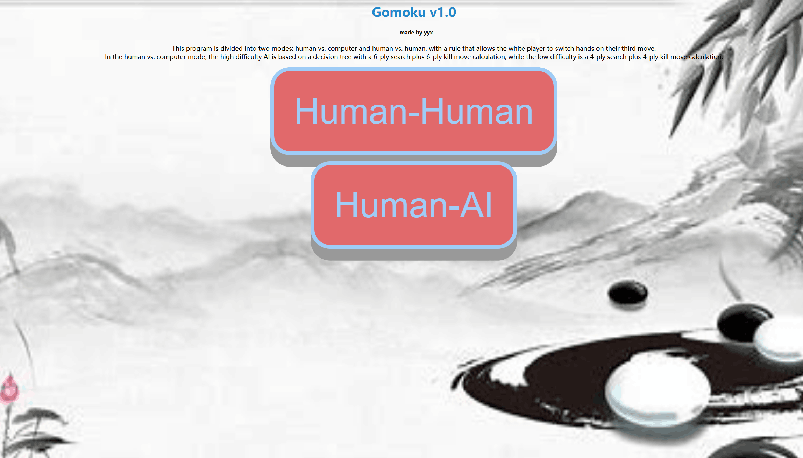

# Gomoku Platform

This platform supports both player-vs-player and player-vs-computer gameplay in the game of Gomoku.

## Core Algorithm

The core algorithm, as implemented in `sample.cpp`, utilizes an alpha-beta pruning search strategy. It supports:

- 6-ply search depth
- 6-ply look-ahead for kill moves

## Getting Started

To start the game, simply run the following script:

```bash
python run.py
 ```

## Demo



